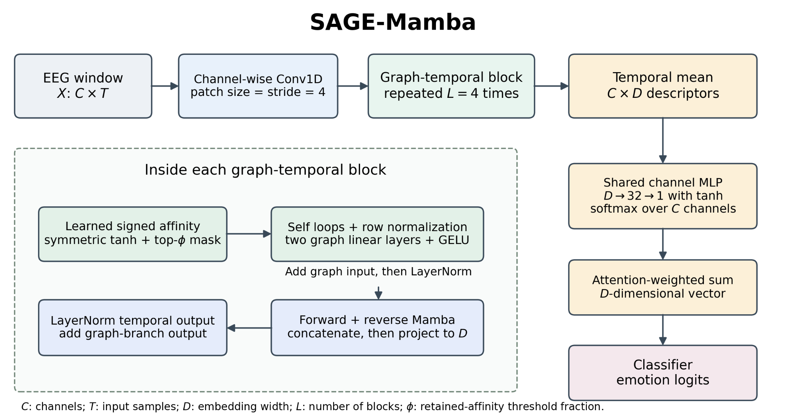

# SAGE-Mamba

EEG emotion classification using learned inter-channel graphs, bidirectional temporal processing, and channel attention. Supports SEED and DREAMER, three backbones (Mamba, LSTM, GRU), and an independently trained dense Mamba comparison (`phi=1`). DREAMER targets are valence and arousal.

Datasets, trained weights, and experiment results are not bundled. Run all commands below from the project directory.

## Architecture



## Repository layout

| Directory / file | Contents |
| --- | --- |
| `sage_mamba/` | Model, training, data loading, shared preprocessing, channel definitions, and output helpers |
| `sage_mamba/cli/` | Training, preprocessing, experiment orchestration, plotting, and environment commands |
| `assets/architecture.png` | Architecture figure |
| `requirements.txt` | Pinned runtime dependencies |

Run commands from the repository root with `python -m sage_mamba.cli.<command>`. For example, `python -m sage_mamba.cli.train_seed --help`. Input and output paths remain relative to your working directory; existing data directory names and CLI options are unchanged.

## Installation

Use a Python virtual environment on the CUDA machine used for Mamba. Runtime dependency versions are pinned in `requirements.txt`.

```bash
python -m venv .venv
source .venv/bin/activate
python -m pip install --upgrade pip setuptools wheel packaging ninja
python -m pip install torch==2.9.0
python -m pip install --no-build-isolation -r requirements.txt
python -m sage_mamba.cli.check_environment
```

Install the PyTorch build compatible with your CUDA environment if the default build differs from your existing setup. Mamba's compiled extensions must match the installed PyTorch/CUDA environment. A missing Mamba dependency raises an error; the code never silently switches to LSTM. CPU execution is available for the LSTM/GRU checks.

## Input layout

The following directories are created by preprocessing or supplied by the user; they are not included in the archive.

| Dataset | Default directory | Required inputs |
| --- | --- | --- |
| SEED | `checkpoints/` | `SUBJECT_YYYYMMDD.npz`, with `X` shaped `(N,62,200)`, `y` in `{-1,0,1}`, and `trial` indices |
| DREAMER | `DREAMER_processed/` | `X.npy` shaped `(N,14,128)`, binary `y_valence.npy` and `y_arousal.npy`, `subject.npy`, `trial.npy` |

Each SEED participant must have three dated recordings; dates determine session order. The top-level `checkpoints/` holds processed SEED data. Trained weights are written under the experiment output directory instead.

## Preprocess the recordings

SEED input is the dataset's 200 Hz channel-by-time EEG MAT recordings in microvolts, with trial variables ending in `_eeg1` through `_eeg15`, plus `label.mat`. This script does not resample arbitrary acquisition files.

```bash
python -m sage_mamba.cli.preprocess_seed --raw-dir /path/to/SEED/Preprocessed_EEG \
  --label-path /path/to/SEED/Preprocessed_EEG/label.mat --out-dir checkpoints

python -m sage_mamba.cli.preprocess_dreamer --mat-path /path/to/DREAMER.mat \
  --out-dir DREAMER_processed
```

Choose empty output directories; preprocessing does not overwrite an existing processed dataset. A custom SEED montage including CB1/CB2 can be supplied with `--montage /path/to/montage.sfp`. The default CB coordinates are approximations, explicitly recorded in the preprocessing metadata.

Both pipelines use a 50 Hz notch, 1–47 Hz FIR band-pass, iterative bad-channel interpolation, average reference, one-second non-overlapping windows, and robust peak-to-peak rejection. SEED uses per-channel recording-session normalization. DREAMER uses the final 60 seconds of each trial's neutral baseline, then windows and rejects the normalized stimulus. The low-variance midline channels in SEED are not marked bad solely for low variance. DREAMER scores are binarized with `score > 3`. Both pipelines also write `quality_report.csv` and `preprocessing.json`; DREAMER additionally writes `y_scores.npy`. The exact processing thresholds and ordering are defined in `sage_mamba/preprocessing.py` and the dataset-specific preprocessing scripts.

**SEED preprocessing is a reconstruction**: the original preprocessing script was unavailable, so identical historical window counts or results are not guaranteed.

## Run the experiments

For the three sparse models and both protocols:

```bash
python -m sage_mamba.cli.train_seed --data-dir checkpoints --out-dir results/seed --device cuda
python -m sage_mamba.cli.train_dreamer --data-dir DREAMER_processed --out-dir results/dreamer --device cuda
```

For the full workflow, including an independently trained dense Mamba comparison and figures:

```bash
python -m sage_mamba.cli.run_experiments --dataset seed --data-dir checkpoints \
  --out-dir results/seed --device cuda

python -m sage_mamba.cli.run_experiments --dataset dreamer --data-dir DREAMER_processed \
  --out-dir results/dreamer --device cuda
```

The full SEED workflow performs 96 training runs: 3 sparse backbones plus dense Mamba, 2 protocols, 4 conditions, and 3 random seeds. DREAMER performs 48 runs for the same variants, 2 protocols, 2 targets, and 3 seeds. Default epochs are 25 for every run. Completed runs resume only when the source, input checksums, and relevant settings match. Interrupted individual runs restart from initialization; this is run-level resume, not optimizer-state resume.

Useful commands:

```bash
python -m sage_mamba.cli.train_seed --data-dir checkpoints --out-dir results/seed_quick \
  --backbones gru --conditions inter_session --protocols inter_subject \
  --seeds 42 --epochs 1 --device cpu

python -m sage_mamba.cli.train_dreamer --data-dir DREAMER_processed --out-dir results/dreamer_dense \
  --backbones mamba --phi 1 --device cuda
```

Use a new `--out-dir` when changing epochs, data, export coverage, or implementation. This folder reorganization changes import statements and therefore the recorded source checksums; use a new output directory for runs from this layout. `--no-save-checkpoints` disables trained-weight export; `--no-save-artifacts` disables graph/attention export. The full workflow keeps both enabled.

## Evaluation definitions

The protocol names have the following definitions in this implementation:

| Name | Train/test split | Reported accuracy |
| --- | --- | --- |
| `intra_subject` | Shuffle each participant's selected windows and allocate 80%/20%; pool all training portions to fit one model | Arithmetic mean of participants' test accuracies |
| `inter_subject` | Pool selected windows from all participants, shuffle, and allocate 80%/20% | Accuracy across the pooled test windows |

The second protocol does **not** hold out participants. Neither protocol holds out complete trials; windows from the same trial may be present in both partitions. There is no LOSO implementation. The `inter_session` SEED condition pools the three sessions before splitting; it is not leave-one-session-out.

The best epoch is selected using the corresponding **test accuracy**, as implemented in `sage_mamba/training.py`. There is no validation partition. Consequently these scores are test-selected rather than estimates from an untouched final test set. Exact split indices, selected epoch, metric, seed, and model parameters are saved with each run. Normalization occurs in the preprocessing stage before window splitting.

Tables use mean ± population standard deviation (`ddof=0`) across the requested seeds, default `42 43 44`. Incomplete cells say `pending`; they are not silently summarized over fewer seeds. SAGE-Mamba is placed last. Dense results are kept separately under `phi_1p0`.

## Model settings

| Setting | SEED | DREAMER |
| --- | --- | --- |
| Input channels × samples | 62 × 200 | 14 × 128 |
| Embedding width | 128 | 96 |
| Time tokens, patch size 4 | 50 | 32 |
| Graph-temporal blocks | 4 | 4 |
| Output classes | 3 | 2 per target |
| Classifier activation | ReLU | GELU |
| Graph intermediate activation | GELU | GELU |
| Recurrent hidden units | 128 per direction | 128 per direction |
| Mamba state / convolution / expansion | 16 / 4 / 2 | 16 / 4 / 2 |

Channel descriptors are the temporal mean of the last block. The same `Linear(D,32) → tanh → Linear(32,1)` MLP scores each channel. Softmax is applied over channels, and its weights form the weighted channel sum. The attention vector is input-dependent; the learned block affinity matrices are model parameters shared across input windows.

| Backbone | SEED parameters | DREAMER parameters |
| --- | ---: | ---: |
| SAGE-GRU | 1,087,192 | 879,927 |
| SAGE-LSTM | 1,351,384 | 1,111,351 |
| SAGE-Mamba | 1,226,456 | 706,359 |

These are the expected counts encoded in `sage_mamba/model.py`; training checks them against the instantiated model. The Mamba calculation assumes `mamba_ssm.Mamba` v1 with default `dt_rank=ceil(D/16)`. Dense and sparse models have the same trainable parameter count.

The affinity is `tanh((W + W.T)/2)`. Global absolute-value top-fraction thresholding, a per-row top-2 floor, and symmetric union produce the forward mask; the straight-through estimator passes gradients to pruned entries. The ranking includes the diagonal. Ties and the row floor can make observed off-diagonal density differ from `phi`, and the row floor is not a guarantee of two off-diagonal neighbors. `phi=1` bypasses masking; all other model and training settings remain the same. This is dense tensor multiplication with masked entries, not a sparse-kernel speed optimization.

Optimization uses AdamW, learning rate `1e-3`, weight decay `1e-2`, OneCycleLR, batch size 64, test batch size 128, label smoothing `0.05`, gradient clipping `1.0`, dropout `0.5`, and mean off-diagonal affinity L1 penalty weighted by `5e-4`.

## Figures and numeric exports

```bash
python -m sage_mamba.cli.plot_artifacts \
  --artifact results/seed/phi_0p3/artifacts/inter_subject_mamba_inter_session_seed42.npz \
  --dense results/seed/phi_1p0/artifacts/inter_subject_mamba_inter_session_seed42.npz \
  --out-dir results/seed/figures/inter_session

python -m sage_mamba.cli.draw_architecture --out-dir results/architecture
```

Omit `--dense` to plot one trained model. The same command supports DREAMER artifacts by replacing the paths and using `valence` or `arousal`. Outputs include PNG, PDF, and editable SVG files:

- `graph_per_block`: one model's block graphs, with transparent electrode labels, space below titles, and attention-proportional node areas.
- `attention_topomap`: channel attention with explicit seed and sample count.
- `graph_dense_sparse` and `attention_dense_sparse`: matching dense/sparse comparisons.
- `graph_statistics.csv`, `channel_attention.csv`, and `plot_metadata.json`: numeric data and plot provenance.
- `architecture`: an operation-level model overview with notation explained in the figure.

Plots number blocks **1–4**. Red/blue indicate positive/negative learned affinities. Statistics count all undirected off-diagonal edges once; by default only the 60 strongest edges are drawn per panel. Node area is proportional to attention with no additive area offset. Graph affinities are exported before adding self loops and row normalization.

Attention is averaged over the **entire test split** by default. To limit the export, use `--attention-batches 8`, which uses up to 1,024 test windows. This is a single-seed map, not a three-seed average. Exports record the exact contributing indices and counts. Dense/sparse pairing verifies matching dataset, backbone, seed, protocol, channel order, split hashes, and attention-window indices.

Both panels share one color normalization and one colorbar. Limits cover all electrode values and all rendered interpolated values, avoiding clipping of the strongest attention peak. Default interpolation is linear. Optional `--interpolation cubic` can create interpolation overshoot; the limits still include those extrema. CB1/CB2 are excluded from scalp topomap interpolation without renormalizing the remaining weights; approximate CB locations are used only for graph display and default SEED preprocessing.

Learned affinities and attention weights are model quantities. Edge signs are not labels for excitatory/inhibitory neural connections, and scalp attention is not source-localized brain activity.

## Environment and input checks

```bash
python -m sage_mamba.cli.check_environment
python -m sage_mamba.cli.train_seed --data-dir checkpoints --check-data
python -m sage_mamba.cli.train_dreamer --data-dir DREAMER_processed --check-data
```

`sage_mamba/cli/check_environment.py` reports installed versions, CUDA availability, and model parameter counts where dependencies are available. `--check-data` loads the processed inputs and reports dimensions and class counts without training. These checks do not establish scientific reproducibility.
